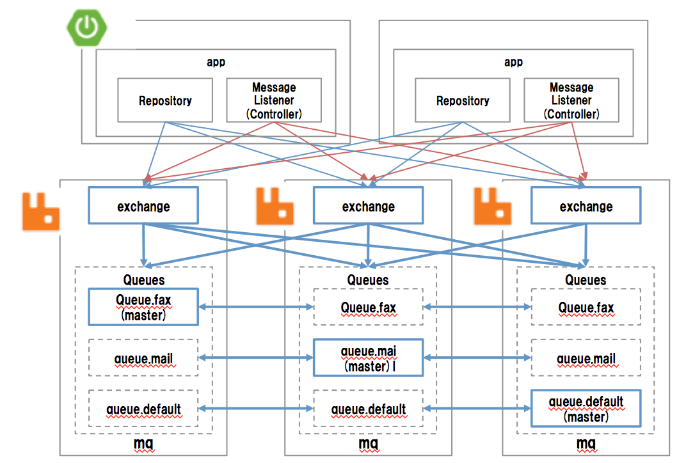

# 構成

クラスタ + ミラーキュー




# 2重配信制御

## 2重配信の発生
Spring AMQPのデフォルト設定のacknowledgeModeの設定だと、RabbitMQは配信保証はat-least-once deliveryになるため、必ず配信はされるが、重複配信が発生する。具体的なケースは以下の通り。
* Consumer Aが処理中にRabbitMQとConsumer Aの接続が切断された場合、RabbitMQでは対象メッセージをReadyに戻す。
* このとき他に対象キューに接続するConsumer Bが存在していればConsumer BがReadyのメッセージの処理を開始する。
* Consumer Aはトランザクション成功してDBコミットした後RabbitMQにACKを返却するが接続切れてるので
エラーになる。ただしトランザクションは成功(Listener自体にTransactionManagerを設定しない場合）
* Consumer Bはトランザクション成功してRabbitMQにACKを返す。

## 防止策
Oracle DBの行ロックの仕組みを利用してConsumer Aが処理中の場合、Consumer Bをロック取得エラーで即時エラーとする。
* Publish時にRABBITMQ_MUTEXテーブルにメッセージIDを発番&登録
* RabbitMQへのメッセージヘッダにx-message-mutexとして登録したメッセージIDを設定
* Consumerではx-message-mutexを取り出してselect 1 from RABBITMQ_MUTEX where mutex=? for update nowaitする。既にロックが取られていればエラーでメッセージをDLQに移動する。
* ロックが取れたら処理を続行し、終了すればdelete from RABBITMQ_MUTEX where mutex=?でID削除
* ロック取得〜業務処理〜ID削除まで同一DBコネクション&トランザクションで実行することで、「x-message-mutexがDBに存在=未処理」を確定させる。


TransactionManagerをListenerに設定するとチャネル接続エラーでDBロールバックが実行されてしまうため、ロック取得成功しても業務処理は実行されたことにならなくなってしまう。
そのため、TransactionManagerはListenerには設定しない。

## 状態

x-message-mutexを利用した場合のパターンは以下の通り

| RABBITMQ_MUTEX | DLQ | 通常キュー | 意味 | 実行アクション |
|----------------|-----|------------|------|-----------|
| 有り           | 有り| 有り      | 重複配信が発生しConsumer Aがまだ処理中| wait |
| 有り           | 有り| 無し      | 通常配信でエラーが発生 | rerun |
| 有り           | 無し| 有り　     | 通常配信で処理中 | wait |
| 有り           | 無し| 無し       | Produce時にエラー | ログファイルを確認 |
| 無し           | 有り| 有り       | 不正な状態 | 要調査、アプリが重複配信制御してない可能性 |
| 無し           | 有り| 無し       | 重複は威信が発生しConsumer Aの処理完了 | DLQ削除 |
| 無し           | 無し| 有り       | 不正な状態 | 要調査、アプリが重複配信制御してない可能性 |
| 無し           | 無し| 無し       | 何もしていない | nothing |

## 準備

下記DDLを実行しておきます。

```sql
DROP TABLE RABBITMQ_MUTEX;
DROP SEQUENCE RABBITMQ_MUTEX_SEQ;
CREATE TABLE RABBITMQ_MUTEX ( MUTEX NUMBER(18) ,CREATED_AT TIMESTAMP );
CREATE SEQUENCE RABBITMQ_MUTEX_SEQ START WITH 1 INCREMENT BY 1 MAXVALUE 99999 CYCLE;
```

## アプリケーションへ組み込み

### ライブラリ追加設定

* Mavenの場合

pom.xmlのdependenciesへ下記を追加します。

```xml
<dependency>
    <groupId>spring.support</groupId>
    <artifactId>spring-rabbit-support</artifactId>
    <version>1.0.0</version>
</dependency>
```

* Gradleの場合

build.gradleのdependenciesへ下記を追加します。

```groovy
compile('spring.supprt:spring-rabbit-support:1.0.0')
```

### Spring Boot設定

デフォルトだと、Spring Bootは、外部ライブラリ内に定義されたBeanを探してDI登録したりはしないので、
DI登録対象とするため、Applicationクラスなどに下記アノテーションを追加して、外部ライブラリ内のコンポーネントを登録させます。

```java
@SpringBootApplication(scanBasePackages = {
  "アプリケーションルートパッケージ", // アプリケーション側のパッケージルート
  "spring.support.amqp.rabbit"   // 二重配信制御コンポーネントのパッケージルート
})
```

### 送信処理側

送信処理を行う側では下記Beanを二重配信制御機能付きメッセージ送信コンポーネントとしてDI定義しておきます。

```java
@Autowired
private ExactlyOnceDeliveryProducer producer;
```

送信時は当該クラスの下記メソッドを呼び出すことで、メッセージと一対一に対応するMUTEX IDが発行され、DBへレコードが登録されます。
また、メッセージ自体のカスタムプロパティとしてもMUTEX IDは登録されます。(プロパティのヘッダキーはx-mutex-id)

```java
/**
 * DBトランザクション完了後にメッセージを送信する.
 *
 * @param exchange エクスチェンジ名
 * @param routingKey ルーティングキー名
 * @param payload メッセージ本体
 */
public String send(String exchange, String routingKey, Object payload) {
  ...
}
```

### 受信処理側

受信処理を行う側で下記メソッドを定義しておきます。
メッセージ・キューは、送信時に設定したexchange/routingKeyによりメッセージが配信された先のキュー名を指定します。
containerFactoryは、RabbitListenerContainerFactoryのbeanを指定します。
このbeanはSpring Bootにより自動登録されますが、独自にカスタマイズしたbeanを登録している場合は、そちらを指定します。

```java
/**
 * メッセージ受信.
 * HeadersおよびPayloadアノテーションは実装ではなくインタフェース側に必要
 *
 * @param headers ヘッダ
 * @param dto 受信DTO
 */
@Transactional
@ExactlyOnceDelivery
@RabbitListener(queues = "メッセージ・キュー", containerFactory = "containerFactory")
void receive(@Headers Map<String, String> headers, @Payload Sample data) {
  ...
}
```

上記はリスナーメソッドで、指定したキューにメッセージが配信されると、その内容を引数としてメソッドが呼び出されます。
ExactOnceDeliveryアノテーションにより、あるメッセージの受信に対しては、当該メソッドが一回だけ呼び出されることが保証されます。
